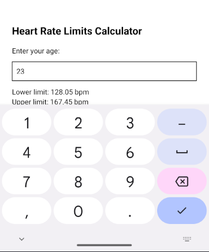

# Heart rate limits calculator

### Week 1 Assignment. 

#### Uses 2 formulas to calculate heart rate based on age:

##### **Lower limit**: (220 - age) x 0.65
##### **Upper limit**: (220 - age) x 0.85

Heart rate is calculated on keystroke.

## Screenshot from app

