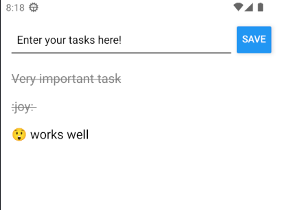

# Week 4

### ToDo list

#### What it does?

- Displays a list of tasks
- User can add a new task to the list
- Done / undone marking by pressing the task name.
- Data saving to phone's memory (AsyncStorage)

### App view

